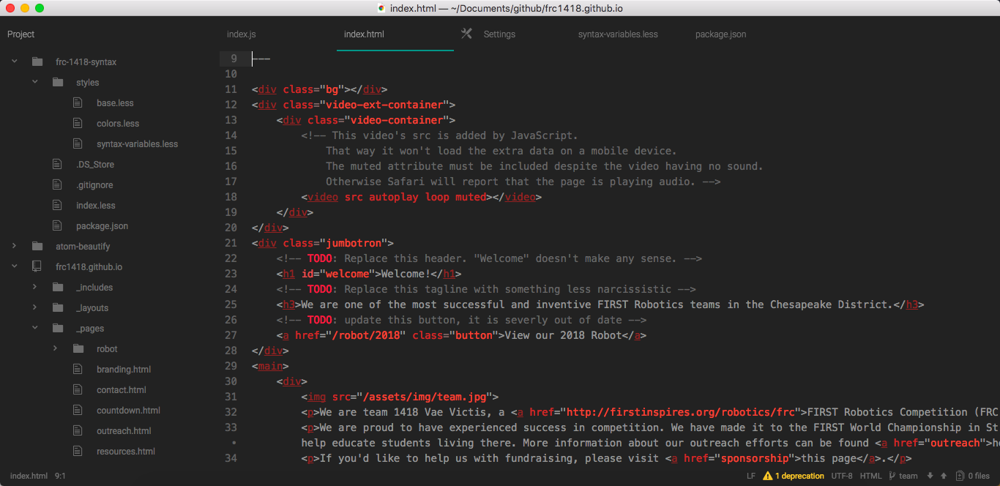
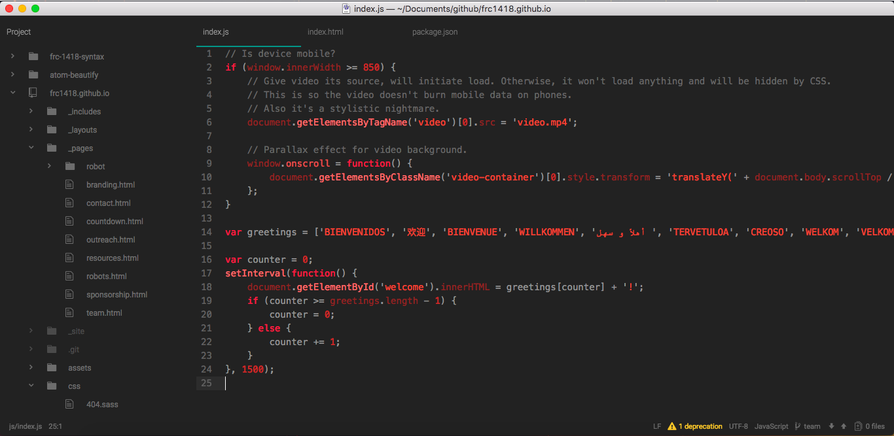
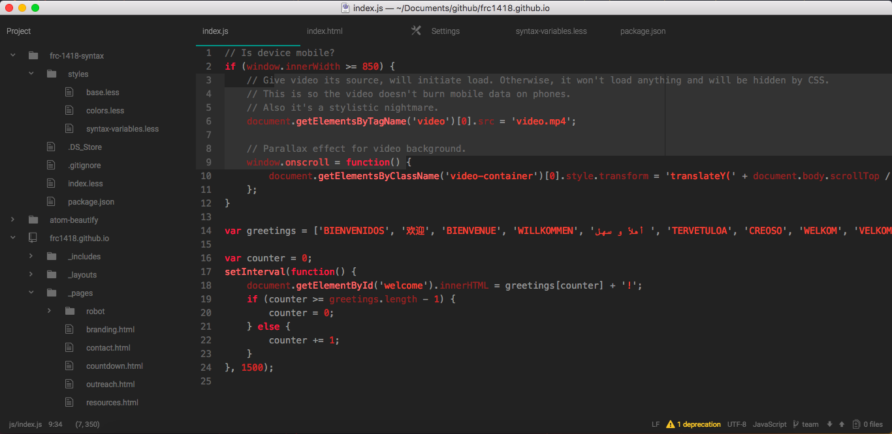

# FRC1418 Syntax
The official Atom syntax theme of FRC team 1418

## Installation
The theme can be found online at:

To install through Atom:
1. Navigate to Atom > Preferences (cmd + ,) on the top bar.
2. Click **Install** at the bottom of the list on the left.
3. Click the **Themes** button on the far right.
4. Enter "FRC 1418" into the search box.
5. Click the **Install** button on the "frc-1418-syntax" entry.

To apply the theme:
1. Click the **Themes** button two list entries up.
2. Use the dropdown menu under **Syntax** on the left to select the FRC 1418 theme.
